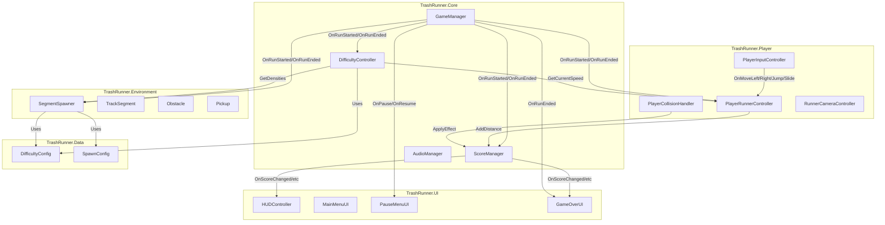

# Design Document

## Overview

TrashRunner is a 3D endless runner Unity game where players control a garbage truck collecting trash on city streets. This design document outlines the architecture, components, data models, and implementation approach for all core game systems.

The architecture follows a modular, event-driven design with clear separation of concerns. Core managers handle game state and scoring, player components manage movement and input, environment components handle track generation, and UI components respond to events for display updates.

## Architecture

### High-Level System Diagram



### Script File Manifest

All scripts adhere to the 450-line maximum constraint:

**TrashRunner.Core** (~750 lines total)
- `GameManager.cs` (~180 lines) - Game state machine, run lifecycle
- `ScoreManager.cs` (~200 lines) - Statistics tracking, persistence
- `DifficultyController.cs` (~100 lines) - Curve evaluation
- `AudioManager.cs` (~120 lines) - Sound playback

**TrashRunner.Player** (~800 lines total)
- `PlayerRunnerController.cs` (~350 lines) - Movement, lane switching, jump/slide
- `PlayerInputController.cs` (~250 lines) - Input handling, swipe detection
- `PlayerCollisionHandler.cs` (~100 lines) - Collision response
- `RunnerCameraController.cs` (~100 lines) - Camera follow

**TrashRunner.Environment** (~700 lines total)
- `SegmentSpawner.cs` (~400 lines) - Track generation, object pooling
- `TrackSegment.cs` (~80 lines) - Segment data, spawn points
- `Obstacle.cs` (~80 lines) - Obstacle behavior
- `Pickup.cs` (~100 lines) - Pickup behavior with types

**TrashRunner.UI** (~500 lines total)
- `HUDController.cs` (~150 lines) - In-game display
- `MainMenuUI.cs` (~100 lines) - Main menu
- `PauseMenuUI.cs` (~80 lines) - Pause menu
- `GameOverUI.cs` (~120 lines) - Game over screen

**TrashRunner.Data** (~100 lines total)
- `DifficultyConfig.cs` (~40 lines) - Difficulty curves
- `SpawnConfig.cs` (~60 lines) - Spawn configuration

### Interaction Summary

- GameManager coordinates all systems via events (OnRunStarted, OnRunEnded, OnPause, OnResume)
- PlayerRunnerController subscribes to PlayerInputController events for movement commands
- PlayerCollisionHandler detects triggers and delegates to Obstacle/Pickup.ApplyEffect()
- ScoreManager receives distance updates from PlayerRunnerController and stat changes from collisions
- SegmentSpawner queries DifficultyController for current spawn densities
- UI scripts subscribe to ScoreManager and GameManager events in OnEnable/OnDisable
- DifficultyController and SegmentSpawner read from ScriptableObject configs assigned via Inspector

## Components and Interfaces

### GameManager

```csharp
namespace TrashRunner.Core
{
    public enum RunState { Menu, Running, Paused, GameOver }
    
    public class GameManager : MonoBehaviour
    {
        // Events
        public event System.Action OnRunStarted;
        public event System.Action OnRunEnded;
        public event System.Action OnPause;
        public event System.Action OnResume;
        
        // Properties
        public RunState CurrentState { get; private set; }
        
        // Dependencies (SerializeField)
        private ScoreManager scoreManager;
        private DifficultyController difficultyController;
        private SegmentSpawner segmentSpawner;
        private PlayerRunnerController player;
        
        // Public Methods
        public void StartRun();    // 9-step reset sequence
        public void EndRun();      // Transition to GameOver
        public void PauseGame();   // Set timeScale=0, show pause menu
        public void ResumeGame();  // Restore timeScale=1
    }
}
```

**StartRun() 9-Step Sequence:**
1. Reset player position to start (center lane, z=0)
2. Call `segmentSpawner.ResetTrack()`
3. Call `scoreManager.ResetStats()`
4. Call `difficultyController.ResetTime()`
5. Ensure player GameObject is active/enabled
6. Reset player lane to center (index 1)
7. Return all pooled objects to inactive state (via SegmentSpawner)
8. Set CurrentState to Running
9. Invoke OnRunStarted event

### ScoreManager

```csharp
namespace TrashRunner.Core
{
    public class ScoreManager : MonoBehaviour
    {
        // Events
        public event System.Action<int> OnCoinsChanged;
        public event System.Action<int> OnTrashChanged;
        public event System.Action<int> OnLivesChanged;
        public event System.Action<float> OnDistanceChanged;
        public event System.Action<int> OnScoreChanged;
        
        // Tunable Fields (SerializeField)
        private int scorePerMeter;
        private int scorePerCoin;
        private int scorePerTrash;
        private int initialLives;
        
        // Properties
        public int Coins { get; private set; }
        public int Trash { get; private set; }
        public int Lives { get; private set; }
        public float Distance { get; private set; }
        public int Score { get; private set; }
        public int BestScore { get; private set; }
        
        // Constants
        private const string BEST_SCORE_KEY = "TrashRunner_BestScore";
        
        // Public Methods
        public void ResetStats();
        public void AddDistance(float delta);
        public void AddCoin();
        public void AddTrash();
        public void LoseLife();  // Returns remaining lives
    }
}
```

### DifficultyController

```csharp
namespace TrashRunner.Core
{
    public class DifficultyController : MonoBehaviour
    {
        // Dependencies (SerializeField)
        private DifficultyConfig config;
        
        // State
        private float elapsedRunTime;
        
        // Public Methods
        public float GetCurrentSpeed();
        public float GetObstacleDensity();
        public float GetPickupDensity();
        public void ResetTime();
    }
}
```

### AudioManager

```csharp
namespace TrashRunner.Core
{
    public class AudioManager : MonoBehaviour
    {
        // Audio Sources (SerializeField)
        private AudioSource musicSource;
        private AudioSource sfxSource;
        
        // Audio Clips (SerializeField)
        private AudioClip jumpClip;
        private AudioClip slideClip;
        private AudioClip coinClip;
        private AudioClip trashClip;
        private AudioClip hitObstacleClip;
        private AudioClip buttonClickClip;
        private AudioClip musicClip;
        
        // Toggles (SerializeField)
        private bool muteSFX;
        private bool muteMusic;
        
        // Public Methods
        public void PlayJump();
        public void PlaySlide();
        public void PlayPickupCoin();
        public void PlayPickupTrash();
        public void PlayHitObstacle();
        public void PlayButtonClick();
        public void StartMusic();
        public void StopMusic();
    }
}
```

### PlayerRunnerController

```csharp
namespace TrashRunner.Player
{
    public class PlayerRunnerController : MonoBehaviour
    {
        // Movement Settings (SerializeField)
        private float baseForwardSpeed;
        private float laneWidth;
        private float laneChangeSpeed;
        private float jumpForce;
        private float gravity;
        private float slideDuration;
        
        // Components (SerializeField)
        private CharacterController characterController;
        
        // Dependencies (SerializeField)
        private ScoreManager scoreManager;
        private GameManager gameManager;
        private DifficultyController difficultyController;
        private PlayerInputController inputController;
        private AudioManager audioManager;
        
        // State
        private int currentLaneIndex;  // 0=left, 1=center, 2=right
        private float verticalVelocity;
        private bool isSliding;
        private float slideTimer;
        private float cumulativeDistance;
        private float lastReportedDistance;
        
        // Original CharacterController values (for sliding)
        private float originalHeight;
        private Vector3 originalCenter;
        
        // Public Methods
        public void ResetToStart();
        public void SetLane(int laneIndex);
        
        // Properties
        public bool IsGrounded { get; }
        public bool IsSliding { get; }
    }
}
```

**Movement Logic (Update):**
1. If not Running state, return early
2. Get current speed from DifficultyController
3. Calculate forward movement: `speed * Time.deltaTime`
4. Calculate lane target X: `(currentLaneIndex - 1) * laneWidth`
5. Lerp current X toward target X
6. Apply gravity to verticalVelocity if not grounded
7. Handle slide timer countdown
8. Build movement vector and call `characterController.Move()`
9. Update distance tracking and report to ScoreManager

### PlayerInputController

```csharp
namespace TrashRunner.Player
{
    public class PlayerInputController : MonoBehaviour
    {
        // Events
        public event System.Action OnMoveLeft;
        public event System.Action OnMoveRight;
        public event System.Action OnJump;
        public event System.Action OnSlide;
        
        // Input Asset (SerializeField)
        private InputActionAsset runnerInputAsset;
        
        // Swipe Settings (SerializeField)
        private float minSwipeDistance = 50f;
        private float maxSwipeTime = 0.5f;
        private float directionThreshold = 0.5f;
        
        // Internal State
        private InputActionMap gameplayMap;
        private InputAction moveLeftAction;
        private InputAction moveRightAction;
        private InputAction jumpAction;
        private InputAction slideAction;
        
        // Touch State
        private Vector2 touchStartPosition;
        private float touchStartTime;
    }
}
```

**Input Setup (Awake/OnEnable):**
1. Get "Gameplay" action map from runnerInputAsset
2. Get actions by name: "MoveLeft", "MoveRight", "Jump", "Slide"
3. Subscribe to action.performed callbacks
4. Enable the action map

### PlayerCollisionHandler

```csharp
namespace TrashRunner.Player
{
    public class PlayerCollisionHandler : MonoBehaviour
    {
        // Dependencies (SerializeField)
        private PlayerRunnerController player;
        private ScoreManager scoreManager;
        
        // OnTriggerEnter
        // - Check for Obstacle component, call ApplyEffect
        // - Check for Pickup component, call ApplyEffect
    }
}
```

### RunnerCameraController

```csharp
namespace TrashRunner.Player
{
    public class RunnerCameraController : MonoBehaviour
    {
        // Settings (SerializeField)
        private Transform playerTransform;
        private Vector3 offset;
        private float smoothSpeed;
        private bool useSpeedBasedFOV;
        private float baseFOV;
        private float maxFOV;
        private float maxSpeedForFOV;
        
        // Components
        private Camera cam;
    }
}
```

### SegmentSpawner

```csharp
namespace TrashRunner.Environment
{
    public class SegmentSpawner : MonoBehaviour
    {
        // Settings (SerializeField)
        private int initialSegmentCount;
        private int segmentsAhead;
        private Transform segmentParent;
        private TrackSegment segmentPrefab;
        private SpawnConfig spawnConfig;
        private DifficultyController difficultyController;
        
        // Object Pools
        private Queue<TrackSegment> segmentPool;
        private Dictionary<GameObject, Queue<GameObject>> obstaclePools;
        private Dictionary<GameObject, Queue<GameObject>> pickupPools;
        
        // Active Segments
        private List<TrackSegment> activeSegments;
        private float nextSpawnZ;
        
        // Public Methods
        public void ResetTrack();
        public void RecycleSegment(TrackSegment segment);
    }
}
```

**Pool Pattern:**
```csharp
private GameObject GetFromPool(GameObject prefab, Dictionary<GameObject, Queue<GameObject>> pools)
{
    if (!pools.ContainsKey(prefab))
        pools[prefab] = new Queue<GameObject>();
    
    if (pools[prefab].Count > 0)
    {
        var obj = pools[prefab].Dequeue();
        obj.SetActive(true);
        return obj;
    }
    
    return Instantiate(prefab);
}

private void ReturnToPool(GameObject obj, GameObject prefab, Dictionary<GameObject, Queue<GameObject>> pools)
{
    obj.SetActive(false);
    if (!pools.ContainsKey(prefab))
        pools[prefab] = new Queue<GameObject>();
    pools[prefab].Enqueue(obj);
}
```

### TrackSegment

```csharp
namespace TrashRunner.Environment
{
    public class TrackSegment : MonoBehaviour
    {
        // Settings (SerializeField)
        private float length = 10f;
        private Transform[] laneSpawnPoints;  // 3 transforms for lanes
        
        // Properties
        public float Length => length;
        public Transform[] SpawnPoints => laneSpawnPoints;
        
        // Active spawned objects (for recycling)
        private List<GameObject> spawnedObjects;
        
        // Public Methods
        public void ClearSpawnedObjects();
        public void AddSpawnedObject(GameObject obj);
    }
}
```

### Obstacle

```csharp
namespace TrashRunner.Environment
{
    public class Obstacle : MonoBehaviour
    {
        // Dependencies (SerializeField)
        private AudioManager audioManager;
        
        // State
        private bool effectApplied;
        
        // Public Methods
        public void ApplyEffect(PlayerRunnerController player, ScoreManager scoreManager);
        public void ResetObstacle();  // Called when recycled
    }
}
```

### Pickup

```csharp
namespace TrashRunner.Environment
{
    public enum PickupType { Coin, Trash }
    
    public class Pickup : MonoBehaviour
    {
        // Settings (SerializeField)
        private PickupType pickupType;
        
        // Dependencies (SerializeField)
        private AudioManager audioManager;
        
        // State
        private bool effectApplied;
        
        // Public Methods
        public void ApplyEffect(PlayerRunnerController player, ScoreManager scoreManager);
        public void ResetPickup();  // Called when recycled
    }
}
```

### UI Controllers

All UI scripts follow the OnEnable/OnDisable subscription pattern:

```csharp
namespace TrashRunner.UI
{
    public class HUDController : MonoBehaviour
    {
        // UI References (SerializeField)
        private TextMeshProUGUI distanceText;
        private TextMeshProUGUI scoreText;
        private TextMeshProUGUI coinsText;
        private TextMeshProUGUI trashText;
        private TextMeshProUGUI livesText;
        
        // Dependencies (SerializeField)
        private ScoreManager scoreManager;
        
        // Subscribe in OnEnable, unsubscribe in OnDisable
    }
    
    public class MainMenuUI : MonoBehaviour
    {
        // UI References (SerializeField)
        private Button playButton;
        private TextMeshProUGUI bestScoreText;
        
        // Dependencies (SerializeField)
        private GameManager gameManager;
        private ScoreManager scoreManager;
    }
    
    public class PauseMenuUI : MonoBehaviour
    {
        // UI References (SerializeField)
        private Button resumeButton;
        private Button mainMenuButton;
        
        // Dependencies (SerializeField)
        private GameManager gameManager;
    }
    
    public class GameOverUI : MonoBehaviour
    {
        // UI References (SerializeField)
        private TextMeshProUGUI finalScoreText;
        private TextMeshProUGUI finalDistanceText;
        private TextMeshProUGUI finalCoinsText;
        private TextMeshProUGUI finalTrashText;
        private Button retryButton;
        private Button mainMenuButton;
        
        // Dependencies (SerializeField)
        private GameManager gameManager;
        private ScoreManager scoreManager;
    }
}
```

## Data Models

### DifficultyConfig (ScriptableObject)

```csharp
namespace TrashRunner.Data
{
    [CreateAssetMenu(fileName = "DifficultyConfig", menuName = "TrashRunner/DifficultyConfig")]
    public class DifficultyConfig : ScriptableObject
    {
        [Tooltip("X: elapsed time (seconds), Y: forward speed")]
        public AnimationCurve speedOverTime;
        
        [Tooltip("X: elapsed time (seconds), Y: obstacle spawn density (0-1)")]
        public AnimationCurve obstacleDensityOverTime;
        
        [Tooltip("X: elapsed time (seconds), Y: pickup spawn density (0-1)")]
        public AnimationCurve pickupDensityOverTime;
    }
}
```

**Recommended Curve Values:**
- Speed: Start at 10, ramp to 25 over 120 seconds
- Obstacle Density: Start at 0.3, increase to 0.7 over 90 seconds
- Pickup Density: Start at 0.5, decrease to 0.3 over 90 seconds

### SpawnConfig (ScriptableObject)

```csharp
namespace TrashRunner.Data
{
    [CreateAssetMenu(fileName = "SpawnConfig", menuName = "TrashRunner/SpawnConfig")]
    public class SpawnConfig : ScriptableObject
    {
        [System.Serializable]
        public class ObstacleSpawnEntry
        {
            public GameObject prefab;
            [Range(0f, 1f)] public float spawnProbability;
            public float minDistanceBetweenSpawns;
        }
        
        [System.Serializable]
        public class PickupSpawnEntry
        {
            public GameObject prefab;
            [Range(0f, 1f)] public float spawnProbability;
            public float minDistanceBetweenSpawns;
        }
        
        public List<ObstacleSpawnEntry> obstacleEntries;
        public List<PickupSpawnEntry> pickupEntries;
    }
}
```

### Physics Setup

**Player Prefab (TruckPlayer):**
- CharacterController component (height ~2, radius ~0.5)
- Layer: Player (6)
- No Rigidbody

**Obstacle Prefabs:**
- Collider with isTrigger = true
- Rigidbody with isKinematic = true, useGravity = false
- Obstacle component attached
- Layer: Obstacle (7)

**Pickup Prefabs:**
- Collider with isTrigger = true
- Rigidbody with isKinematic = true, useGravity = false
- Pickup component attached
- Layer: Pickup (8)

**Physics Layer Matrix:**
- Player collides with: Obstacle, Pickup
- Obstacle collides with: Player only
- Pickup collides with: Player only
- Track collides with: None (visual only)

## Error Handling

### Null Reference Protection

All components check dependencies before use:

```csharp
private void Start()
{
    if (scoreManager == null)
        Debug.LogError($"{nameof(PlayerRunnerController)}: ScoreManager reference not assigned!");
    if (gameManager == null)
        Debug.LogError($"{nameof(PlayerRunnerController)}: GameManager reference not assigned!");
}
```

### Event Subscription Safety

```csharp
private void OnEnable()
{
    if (scoreManager != null)
    {
        scoreManager.OnScoreChanged += HandleScoreChanged;
    }
}

private void OnDisable()
{
    if (scoreManager != null)
    {
        scoreManager.OnScoreChanged -= HandleScoreChanged;
    }
}
```

### Pool Exhaustion

SegmentSpawner creates new instances if pool is empty:

```csharp
private GameObject GetFromPool(GameObject prefab, Dictionary<GameObject, Queue<GameObject>> pools)
{
    if (pools[prefab].Count > 0)
        return pools[prefab].Dequeue();
    
    // Pool exhausted, create new instance
    Debug.LogWarning($"Pool exhausted for {prefab.name}, creating new instance");
    return Instantiate(prefab);
}
```

### Input System Validation

```csharp
private void Awake()
{
    if (runnerInputAsset == null)
    {
        Debug.LogError($"{nameof(PlayerInputController)}: InputActionAsset not assigned!");
        enabled = false;
        return;
    }
    
    gameplayMap = runnerInputAsset.FindActionMap("Gameplay");
    if (gameplayMap == null)
    {
        Debug.LogError($"{nameof(PlayerInputController)}: Gameplay action map not found!");
        enabled = false;
        return;
    }
}
```

## Testing Strategy

### Unit Testing Approach

Focus on core logic that can be tested in isolation:

1. **ScoreManager Tests**
   - Verify score calculations (distance, coins, trash)
   - Verify life decrement and game over trigger
   - Verify PlayerPrefs persistence

2. **DifficultyController Tests**
   - Verify curve evaluation at different time values
   - Verify time reset functionality

3. **Lane Calculation Tests**
   - Verify target X position calculation for each lane
   - Verify lane bounds clamping

### Integration Testing

Manual testing scenarios:

1. **Full Run Cycle**
   - Start from menu → play → collect items → hit obstacles → game over → retry

2. **Input Responsiveness**
   - Test all keyboard inputs
   - Test swipe gestures on mobile

3. **Object Pooling**
   - Verify no memory growth during extended play
   - Verify objects properly recycle

4. **State Transitions**
   - Menu → Running → Paused → Running → GameOver → Menu
   - Verify UI panels activate/deactivate correctly

### Performance Validation

- Monitor frame rate during gameplay (target 60 FPS)
- Check for GC allocations in Update loops using Unity Profiler
- Verify object pool sizes are adequate (no runtime instantiation after warmup)
